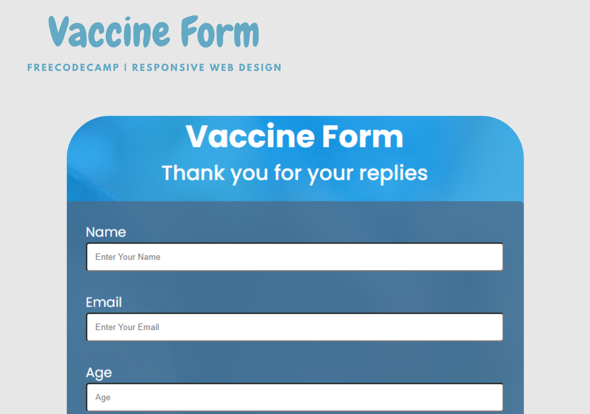

<h1 align="center"> Vaccine Form </h1>

<h3 align="center">
    Complete your vaccine form and help us save lives.
</h3>

  
     
   

  

<h4 align="center"> 
	 Status: Finished
</h4>

  <a href="#-about">About</a>&nbsp;&nbsp;&nbsp;|&nbsp;&nbsp;&nbsp;
  <a href="#-tecnhologies">Technologies</a>&nbsp;&nbsp;&nbsp;|&nbsp;&nbsp;&nbsp;
  <a href="#-project">Project</a>&nbsp;&nbsp;&nbsp;|&nbsp;&nbsp;&nbsp;
  <a href="#-layout">Layout</a>&nbsp;&nbsp;&nbsp;|&nbsp;&nbsp;&nbsp;
  <a href="#memo-license">License</a>

 

  

## 📘 About

Vaccine form is a static web page project, made as one of the prerequisites for training the [Freecodecamp](https://https://www.freecodecamp.org/) responsive web design certification. In it, CSS tools were applied for responsiveness, as well as for styling. freeCodeCamp is a community of people from all around the world who are learning to code together.   

## 🚀 Technologies

This project was developed with the following technologies:

- HTML
- CSS
- Git & Github

## 💻 Project

Vaccnine is a web page used to register a vaccination information.

- [Visit the project online](https://alcantaravca.github.io/vaccine-form)

## 🖌️ Layout

The layout was inspired by the project challenge on the freecodecamp website. You can view the project layout through [THIS LINK](https://survey-form.freecodecamp.rocks/).

## ✍🏽 Author

<a href="https://www.linkedin.com/in/victor-coutinho-de-alc%C3%A2ntara-8538aa263/">
 
  
 <b>Victor Alcantara</b></a> 
  

 
## :memo: License

This project is licensed under the MIT license.

---

Made with ♥ by Victor Alcantara :wave: [Get in Touch!](https://www.linkedin.com/in/victor-coutinho-de-alc%C3%A2ntara-8538aa263/)